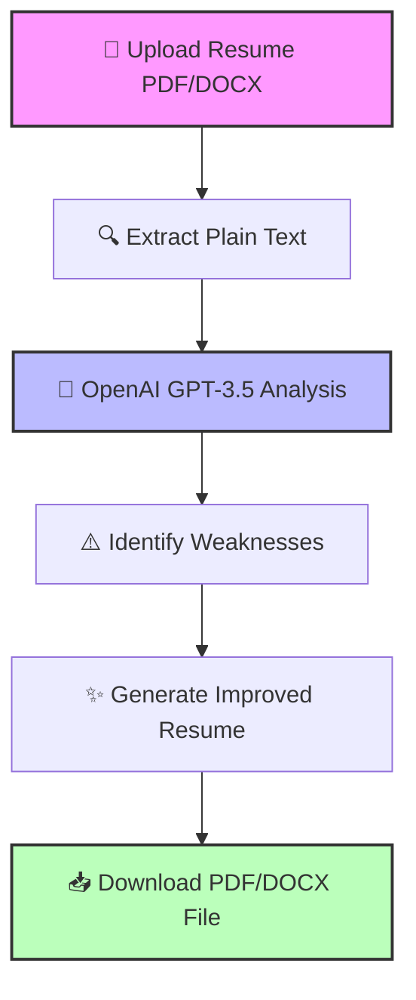

# 🤖 AI Resume Analyzer

<p align="center">
  
  <a href="https://ai-resume-analyzer-aah18751.vercel.app/">🔗 Try the Live App</a>
</p>

<p align="center">
  
  <a href="https://github.com/AbdulAzeemHashmi/AI-Resume-Analyzer">💻 View Source Code</a>
</p>

---

## 🎯 Purpose

AI Resume Analyzer is a modern web application that uses Artificial Intelligence to analyze and improve resumes. Upload your CV in PDF or DOCX format, get detailed feedback on weaknesses, and download an enhanced version, all in one place.

---

## ⚡ Interactive Workflow



---

## ✨ Features

* 📄 **Upload Support:** Handles both PDF and DOCX file formats.
* 🔍 **AI Analysis:** Detects weak action verbs, missing quantifiable achievements, poor formatting, and irrelevant skills.
* ✍️ **Automatic Enhancement:** Rewrites your resume with strong action verbs, professional summaries, and clear achievements.
* 💾 **Smart Download:** Get your improved resume in the same format you uploaded (PDF or DOCX).
* ⚡ **Fast and Simple:** Clean user interface with interactive feedback.

---

## 🛠️ Tech Stack

| Layer | Technology | Description |
| :--- | :--- | :--- |
| **Frontend** | TypeScript + Tailwind CSS | Clean, responsive user interface |
| **Backend** | Python (Flask) | Lightweight web backend |
| **AI Engine** | OpenAI API (GPT-3.5-turbo) | Advanced language model processing |
| **File Parsing** | PyPDF2 + python-docx | Text extraction tools |
| **File Generation** | reportlab + python-docx | PDF and Word document generators |
| **Deployment** | Vercel | Seamless serverless hosting |

---

## 📂 Project Structure

```text
AI-Resume-Analyzer/
├── api/
│   └── index.py             * Vercel serverless entry point
├── backend/
│   ├── app.py               * Main Flask application
│   ├── requirements.txt     * Local python dependencies
│   ├── .env.example         * Environment variable template
│   └── tests/
│       └── test_upload.py   * Unit tests
├── frontend/
│   ├── index.html           * Main webpage
│   ├── script.ts            * TypeScript logic
│   ├── package.json         * Node.js dependencies
│   └── dist/
│       └── script.js        * Compiled JavaScript
├── vercel.json              * Vercel deployment configuration
├── requirements.txt         * Root python dependencies for Vercel
├── .gitignore               * Files ignored by Git
└── README.md                * This file
```

---

## 🚀 Deployment on Vercel

This project is deployed on Vercel. The `vercel.json` file routes API requests to the Python backend and serves static files from the frontend folder. The backend runs as a serverless function using the `api/index.py` handler.

👉 **Live URL:** [https://ai-resume-analyzer-aah18751.vercel.app/](https://ai-resume-analyzer-aah18751.vercel.app/)

---

## 🧪 Local Setup Instructions

Follow these steps to run the project on your own computer.

### 📋 Prerequisites

* Python 3.8 or higher
* Node.js and npm (for the frontend)
* An OpenAI API key (get it from platform.openai.com)

### 🔧 Backend Setup

```bash
# 1. Go to the backend folder
cd backend

# 2. Create a Python virtual environment
python -m venv venv

# 3. Activate the virtual environment
# On Windows:
venv\Scripts\activate
# On Mac/Linux:
source venv/bin/activate

# 4. Install all required packages
pip install -r requirements.txt

# 5. Create your environment file from the example
cp .env.example .env

# 6. Open the .env file and add your OpenAI API key
# Example: OPENAI_API_KEY=sk-your-actual-key-here

# 7. Run the Flask server
python app.py
```

The backend will start at `http://localhost:5000`.

### 🎨 Frontend Setup

The frontend is a simple static web page. You can serve it with any static server.

```bash
# 1. Go to the frontend folder
cd frontend

# 2. Install npm dependencies
npm install

# 3. Build or run the frontend
# For development with live reload:
npm run dev

# For production build:
npm run build
```

*Note:* The frontend expects the backend API to be available at `/api/...` (relative path). If you are running the backend locally on port 5000, you may need to configure the API base URL in the frontend configuration.

---

## 🧪 Running Tests

To run the backend unit tests:

```bash
cd backend
python -m pytest tests/
```

To run tests with coverage:

```bash
python -m pytest --cov=. tests/
```

---

## 🤝 Contributing

Contributions, issues, and feature requests are welcome! Feel free to check the issues page.

---

## 📄 License

This project is open source and available under the MIT License.

---

## 🙏 Acknowledgements

* OpenAI for providing the GPT-3.5-turbo API.
* Flask and the Python community for the web framework.
* Vercel for hosting and serverless deployment.

---

**Made with ❤️ by Abdul Azeem**
